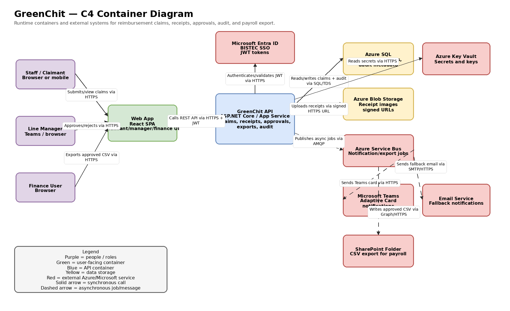
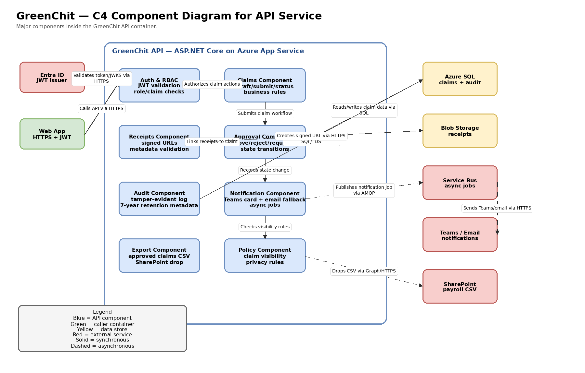

# GreenChit — Architecture Design Pack

## 1. System Context

GreenChit is an internal BISTEC reimbursement tool. Staff submit expense claims with category, date, amount in LKR, description, and receipt images. Line managers approve, reject, or request more information. Finance exports approved claims to a CSV file that payroll automation reads from SharePoint. The system protects claim privacy, stores receipts in Azure Blob Storage using signed URLs, integrates with Microsoft Entra ID for SSO, notifies managers through Teams with email fallback, and keeps a tamper-evident audit log for seven years.

## 2. Containers (C4 Level 2)

| Container / External system | Technology | Responsibility |
|---|---|---|
| Staff / Claimant | Browser or mobile device | Submits claims, uploads receipts, checks claim status. |
| Line Manager | Microsoft Teams and browser | Receives approval notification and approves/rejects/request more information. |
| Finance User | Browser | Exports approved claims for payroll processing. |
| Web App | React SPA | User interface for claimant, manager, finance, and audit users. |
| GreenChit API | ASP.NET Core on Azure App Service | REST API, claim workflow, receipt metadata, approvals, export, RBAC, and audit writing. |
| Azure SQL | Azure SQL Database | System of record for claims, statuses, approval decisions, audit metadata, receipt metadata, and export records. |
| Azure Blob Storage | Azure Blob Storage | Stores receipt image binaries using signed upload/download URL pattern. |
| Azure Service Bus | Azure Service Bus Queue/Topic | Asynchronous notification and export work. |
| Microsoft Entra ID | BISTEC tenant | Single sign-on, JWT issuing, group/role claims. |
| Microsoft Teams | Adaptive Card webhook | Manager approval notifications. |
| Email Service | Microsoft 365 / Azure email path | Fallback notification when Teams delivery fails. |
| SharePoint Folder | SharePoint watched folder | Receives CSV exports for payroll automation. |
| Azure Key Vault | Azure Key Vault | Stores secrets, signing keys, connection strings, and webhook secrets. |

## 3. Components (C4 Level 3) for the API service

| Component | Responsibility |
|---|---|
| Auth & RBAC Component | Validates Microsoft Entra ID JWTs, checks claimant/manager/finance/audit roles, and enforces claim visibility rules. |
| Claims Component | Handles draft creation, submission, status changes, category/date/amount validation, and claim lifecycle rules. |
| Receipts Component | Validates receipt metadata, creates signed Blob Storage URLs, links receipts to claims, and handles upload failure status. |
| Approval Component | Handles manager approval, rejection, request-more-info, and prevents invalid state transitions. |
| Audit Component | Writes tamper-evident state transition logs with actor, timestamp, request ID, previous state, new state, and reason. |
| Notification Component | Publishes Teams Adaptive Card and email fallback jobs through Service Bus. |
| Export Component | Generates approved-claims CSV and drops it into the SharePoint payroll folder. |
| Policy Component | Centralizes privacy rules so only claimant, manager, finance, and audit role can view a claim. |

## 4. Reading order

1. Start with the context paragraph to understand the business process and privacy boundary.
2. Read the container diagram to see runtime pieces and external systems.
3. Read the component diagram to zoom into the GreenChit API responsibilities.
4. Read `diagrams/sequence-submit-approve.md` to follow the submit-and-approve journey.
5. Read the ADRs and trade-off table last to understand why the main choices were made.

## 5. What this design will not do in v1

GreenChit v1 will not build a payroll system, automatic tax calculations, external-user access, OCR/AI receipt extraction, or a native offline-first mobile app. Intermittent upload handling is limited to signed URL retries and clear failure recovery, not full offline sync.
