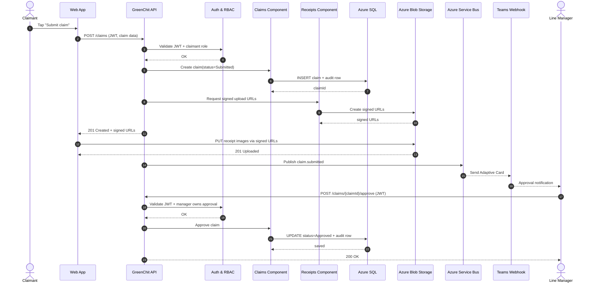
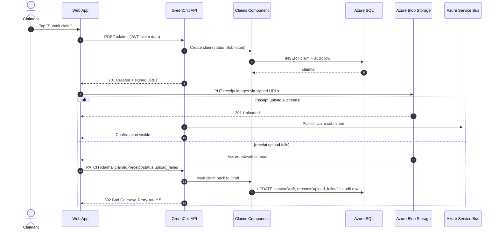

# Sequence — Submit and Approve a Claim

## Happy path

```mermaid
sequenceDiagram
  autonumber
  actor U as Claimant
  participant FE as Web App
  participant API as GreenChit API
  participant AUTH as Auth & RBAC
  participant CLAIMS as Claims Component
  participant RECEIPTS as Receipts Component
  participant DB as Azure SQL
  participant BLOB as Azure Blob Storage
  participant BUS as Azure Service Bus
  participant TEAMS as Teams Webhook
  actor MGR as Line Manager

  U->>FE: Tap "Submit claim"
  FE->>API: POST /claims (JWT, claim data)
  API->>AUTH: Validate JWT + claimant role
  AUTH-->>API: OK
  API->>CLAIMS: Create claim(status=Submitted)
  CLAIMS->>DB: INSERT claim + audit row
  DB-->>CLAIMS: claimId
  API->>RECEIPTS: Request signed upload URLs
  RECEIPTS->>BLOB: Create signed URLs
  BLOB-->>RECEIPTS: signed URLs
  API-->>FE: 201 Created + signed URLs
  FE->>BLOB: PUT receipt images via signed URLs
  BLOB-->>FE: 201 Uploaded
  API->>BUS: Publish claim.submitted
  BUS-->>TEAMS: Send Adaptive Card
  TEAMS-->>MGR: Approval notification
  MGR->>API: POST /claims/{claimId}/approve (JWT)
  API->>AUTH: Validate JWT + manager owns approval
  AUTH-->>API: OK
  API->>CLAIMS: Approve claim
  CLAIMS->>DB: UPDATE status=Approved + audit row
  DB-->>CLAIMS: saved
  API-->>MGR: 200 OK
```

## Error path — receipt upload fails after the claim was created

```mermaid
sequenceDiagram
  autonumber
  actor U as Claimant
  participant FE as Web App
  participant API as GreenChit API
  participant CLAIMS as Claims Component
  participant DB as Azure SQL
  participant BLOB as Azure Blob Storage
  participant BUS as Azure Service Bus

  U->>FE: Tap "Submit claim"
  FE->>API: POST /claims (JWT, claim data)
  API->>CLAIMS: Create claim(status=Submitted)
  CLAIMS->>DB: INSERT claim + audit row
  DB-->>CLAIMS: claimId
  API-->>FE: 201 Created + signed URLs
  FE->>BLOB: PUT receipt images via signed URLs

  alt receipt upload succeeds
    BLOB-->>FE: 201 Uploaded
    API->>BUS: Publish claim.submitted
    API-->>FE: Confirmation visible
  else receipt upload fails
    BLOB-->>FE: 5xx or network timeout
    FE->>API: PATCH /claims/{claimId}/receipt-status upload_failed
    API->>CLAIMS: Mark claim back to Draft
    CLAIMS->>DB: UPDATE status=Draft, reason="upload_failed" + audit row
    API-->>FE: 502 Bad Gateway, Retry-After: 5
  end
```
